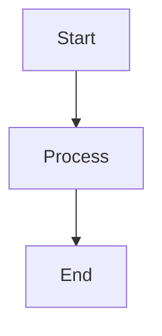
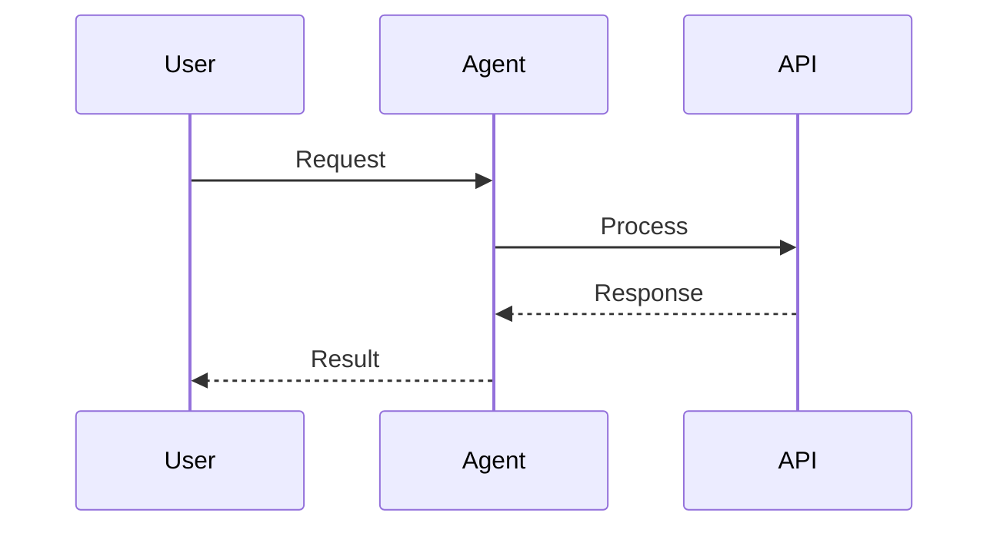
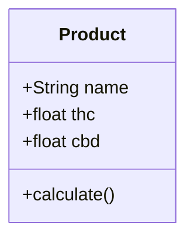
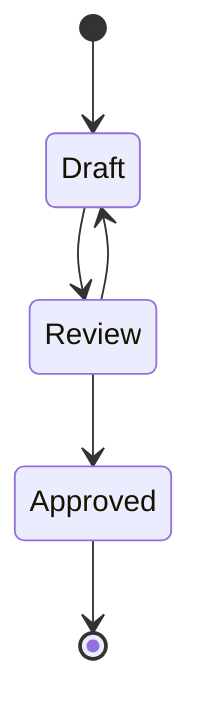

# Mermaid Diagram Support Implementation

## Overview
This document describes the implementation of Mermaid diagram rendering support in the Formul8 Multiagent Chat interface.

## Features
- **Automatic Detection**: The chat interface automatically detects Mermaid code blocks in agent responses using the syntax: ` ```mermaid ... ``` `
- **Client-Side Rendering**: Diagrams are rendered client-side using the Mermaid.js library (v11)
- **Multiple Diagram Types**: Supports all Mermaid diagram types including:
  - Flowcharts
  - Sequence diagrams
  - Class diagrams
  - State diagrams
  - Gantt charts
  - Pie charts
  - And more

## Implementation Details

### Files Modified
1. **src/server.ts**: Main server file with chat interface
2. **scripts/build-pages.js**: Static page builder for GitHub Pages deployment

### Key Changes

#### 1. Mermaid Library Integration
```html
<script src="https://unpkg.com/mermaid@11/dist/mermaid.min.js"></script>
<script>
    if (typeof mermaid !== 'undefined') {
        mermaid.initialize({ startOnLoad: false, theme: 'default' });
    }
</script>
```

#### 2. CSS Styling
```css
.mermaid-diagram {
    background: white;
    padding: 20px;
    border-radius: 8px;
    margin: 10px 0;
    overflow-x: auto;
}
.mermaid-container {
    display: flex;
    justify-content: center;
    align-items: center;
    min-height: 100px;
}
```

#### 3. Message Processing
The `addMessage()` function was updated to:
- Detect Mermaid code blocks using regex: `/\`\`\`mermaid\\n([\\s\\S]*?)\`\`\`/g`
- Replace code blocks with placeholder containers
- Asynchronously render diagrams using `mermaid.render()`
- Handle rendering errors gracefully

### Example Usage

#### Agent Response with Mermaid Diagram
```javascript
const response = `Here's a flowchart showing our cannabis product development process:

\`\`\`mermaid
graph TD
    A[Product Concept] --> B[Formulation Design]
    B --> C[Compliance Review]
    C --> D[Testing & Analysis]
    D --> E{Results OK?}
    E -->|Yes| F[Production]
    E -->|No| B
    F --> G[Quality Control]
    G --> H[Market Release]
\`\`\`

This diagram illustrates the key stages from initial concept to market release.`;
```

#### Rendered Output
The above Mermaid code will be automatically detected and rendered as an interactive SVG diagram in the chat interface.

## Testing

### API Test
```bash
# Test that the API returns Mermaid syntax correctly
curl -X POST http://localhost:3000/api/chat \
  -H "Content-Type: application/json" \
  -d '{"message": "Show me a flowchart", "user_id": "test"}'
```

Expected response should contain:
```json
{
  "success": true,
  "response": "... ```mermaid\\ngraph TD\\n ... ```",
  ...
}
```

### Automated Tests
Run the included Playwright test:
```bash
npm test -- tests/api/mermaid.spec.ts
```

### Manual Testing
1. Start the server: `npm start`
2. Navigate to `http://localhost:3000/`
3. Type a message asking for a diagram or flowchart
4. Observe that the diagram is rendered in the chat interface

## Supported Diagram Types

### Flowchart


### Sequence Diagram


### Class Diagram


### State Diagram


## Error Handling
- If Mermaid library fails to load, diagrams won't render but the chat interface remains functional
- Rendering errors are displayed with error messages instead of breaking the UI
- Invalid Mermaid syntax is caught and displayed with descriptive error messages

## Browser Compatibility
- Works in all modern browsers (Chrome, Firefox, Safari, Edge)
- Requires JavaScript to be enabled
- CDN-based delivery ensures users always get the latest stable version

## Notes
- The implementation uses the unpkg CDN for Mermaid.js delivery
- Diagrams are rendered client-side for better performance
- The rendering is asynchronous to prevent blocking the UI
- Multiple diagrams in a single message are supported
