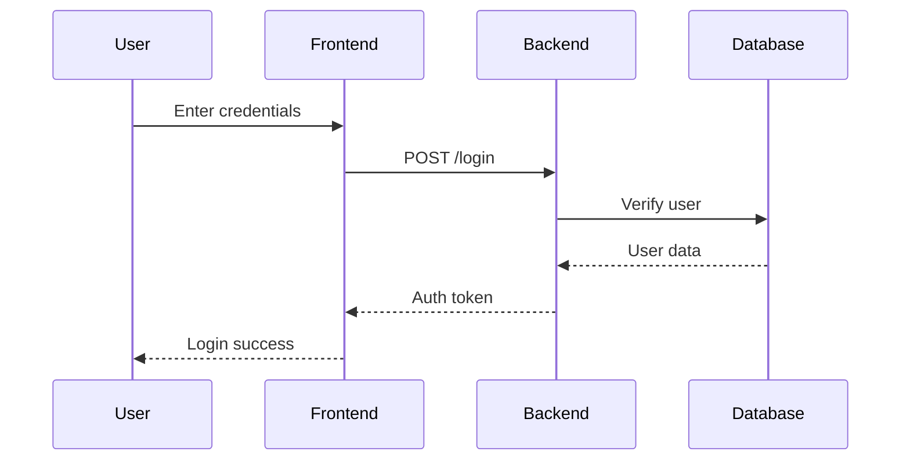
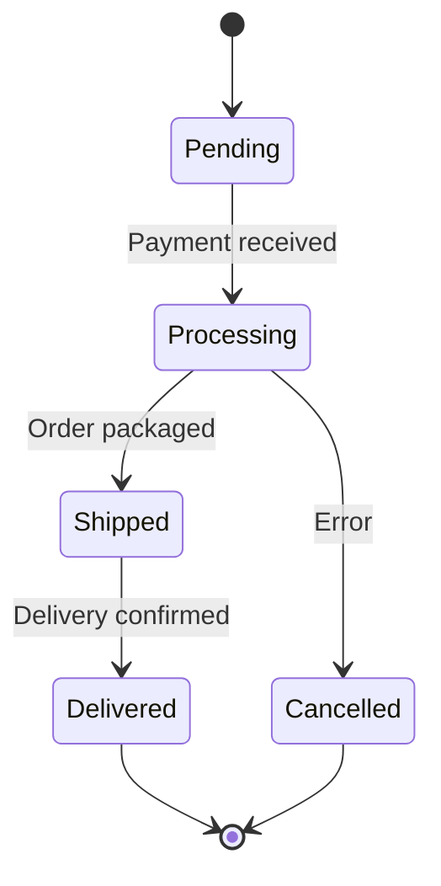

# Testing Mermaid Diagram Rendering

## Quick Test
To quickly verify that Mermaid diagram support is working:

### 1. Start the Server
```bash
npm run build
npm start
```

### 2. Open Browser
Navigate to `http://localhost:3000/`

### 3. Test with Messages
Try these messages in the chat interface:
- "Show me a flowchart"
- "Create a diagram"
- "Show me a mermaid diagram"

### Expected Result
You should see a rendered flowchart diagram showing the cannabis product development process with nodes like:
- Product Concept
- Formulation Design
- Compliance Review
- Testing & Analysis
- Production
- Quality Control
- Market Release

## Automated Tests

### Run Playwright Tests
```bash
npm test -- tests/api/mermaid.spec.ts
```

This validates:
- API returns Mermaid syntax correctly
- HTML page includes Mermaid library
- Regex patterns work for detecting Mermaid blocks

### Run Custom Test Script
```bash
# Start server first
npm start

# In another terminal
node tests/test-mermaid-api.js
```

## Manual Verification Checklist

- [ ] Server starts without errors
- [ ] Chat interface loads in browser
- [ ] Mermaid.js library loads (check browser DevTools Console)
- [ ] Sending "Show me a flowchart" returns a diagram
- [ ] Diagram renders as SVG (not plain text code)
- [ ] Multiple diagrams in one message work
- [ ] Error handling works (invalid syntax shows error message)

## Troubleshooting

### Diagram Not Rendering
1. Check browser console for errors
2. Verify Mermaid.js library loaded (should see it in Network tab)
3. Check if CDN is accessible from your network
4. Try refreshing the page

### API Returns Plain Text
- This is expected! The API returns Mermaid syntax as text
- The browser (client-side JavaScript) renders it as a diagram

### No Diagram After Message
- Wait a moment for asynchronous rendering
- Check browser console for rendering errors
- Verify the message contains valid Mermaid syntax

## Examples of Supported Diagrams

### Flowchart
```
Show me a flowchart
```

### Sequence Diagram  
```
Create a sequence diagram showing user authentication flow:


```

### State Diagram
```
Show me a state diagram for order processing:


```

## Browser Compatibility
Tested and working in:
- Chrome 90+
- Firefox 88+
- Safari 14+
- Edge 90+

## Notes
- Diagrams render client-side using JavaScript
- Requires internet connection to load Mermaid.js from CDN
- Large/complex diagrams may take a moment to render
- All standard Mermaid diagram types are supported
