# User - Supabase - Google - F8 Sequence Diagram

This sequence diagram illustrates the complete authentication and request flow between the User, Supabase, Google OAuth, and the F8 Multiagent system.

## Sequence Diagram

```mermaid
sequenceDiagram
    participant U as User
    participant F as Formul8 Frontend<br/>(formul8.ai)
    participant D as Formul8 Dashboard<br/>(formul8-ai-dashboard.vercel.app)
    participant G as Google OAuth<br/>(OAuth 2.0)
    participant S as Supabase<br/>(Database & Auth)
    participant API as F8 API<br/>(f8.syzygyx.com)
    participant A as Specialized Agents<br/>(compliance, formulation, etc.)
    participant AD as Ad Server<br/>(Ad Agent)

    Note over U,A: Authentication Flow

    U->>F: 1. Access formul8.ai
    F->>U: 2. Display login page
    U->>F: 3. Click "Login with Google"
    
    F->>G: 4. Redirect to Google OAuth
    G->>U: 5. Google login prompt
    U->>G: 6. Enter credentials
    G->>F: 7. Return authorization code
    
    F->>G: 8. Exchange code for tokens
    G->>F: 9. Return JWT access token
    
    F->>S: 10. Verify JWT token
    S->>F: 11. Token validation response
    
    F->>S: 12. Create/update user profile
    S->>S: 13. Auto-create profile record
    S->>S: 14. Assign default subscription (free)
    S->>S: 15. Set user role with permissions
    S->>F: 16. Return user data (ID, plan, permissions)
    
    F->>D: 17. Redirect to dashboard with JWT
    D->>S: 18. Verify JWT and fetch user data
    S->>D: 19. Return complete user profile
    D->>U: 20. Display dashboard with user info

    Note over U,A: Request Processing Flow

    U->>D: 21. Access dashboard features
    D->>S: 22. Fetch user data and permissions
    S->>D: 23. Return user profile and subscription
    
    U->>F: 24. Send chat message
    F->>API: 25. POST /api/chat<br/>Authorization: Bearer JWT<br/>Body: {message, plan, username}
    
    API->>S: 26. Verify JWT token
    S->>API: 27. Return user data (profile, subscription, role)
    
    API->>API: 28. Check plan permissions
    API->>API: 29. Apply rate limiting
    API->>API: 30. Select appropriate agent<br/>(based on keywords)
    
    alt Agent Selection
        API->>A: 31. Route to specialized agent<br/>(compliance, formulation, etc.)
        A->>A: 32. Validate plan access
        A->>A: 33. Process request with OpenRouter API
        A->>A: 34. Calculate token usage & costs
        A->>API: 35. Return agent response<br/>{response, tokens_used, cost, agent}
    else Direct API Response
        API->>API: 31. Process with F8 agent
        API->>API: 32. Calculate token usage & costs
    end
    
    API->>S: 36. Log usage metrics<br/>{user_id, tokens, cost, timestamp}
    S->>API: 37. Confirm usage logged
    
    API->>F: 38. Return response with costs<br/>{response, usage: {tokens, cost, agent}}
    F->>U: 39. Display response with usage info

    Note over U,A: Subscription & Plan Management

    U->>D: 37. Request plan upgrade
    D->>S: 38. Update subscription plan
    S->>S: 39. Update user_roles table
    S->>S: 40. Update permissions
    S->>D: 41. Return updated plan data
    D->>U: 42. Show new plan features

    Note over U,A: Security & Rate Limiting

    rect rgb(255, 240, 240)
        Note over API: Rate Limiting by Plan:<br/>Free: 10 req/hour<br/>Standard: 100 req/hour<br/>Enterprise: 1000 req/hour<br/>Admin: Unlimited
    end

    rect rgb(240, 255, 240)
        Note over S: Row Level Security (RLS):<br/>- User can only access own data<br/>- Plan-based feature access<br/>- Automatic profile creation<br/>- Permission validation
    end

    rect rgb(240, 240, 255)
        Note over G: OAuth 2.0 Security:<br/>- Secure token exchange<br/>- JWT token validation<br/>- Token refresh handling<br/>- Scope-based permissions
    end

    Note over U,AD: Ad Serving Flow

    U->>F: 43. Access free plan features
    F->>API: 44. Check user plan status
    API->>S: 45. Verify user subscription
    S->>API: 46. Return plan: "free"
    
    API->>AD: 47. Request ad content<br/>User plan: free<br/>Context: cannabis industry
    AD->>AD: 48. Select relevant ad<br/>Target: cannabis businesses<br/>Format: banner/video
    AD->>API: 49. Return ad content<br/>{ad_id, content, placement}
    
    API->>F: 50. Return response + ad content
    F->>U: 51. Display response with ads
    
    Note over U,AD: Ad Interaction Tracking

    U->>F: 52. Click on ad
    F->>AD: 53. Track ad click<br/>ad_id, user_id, timestamp
    AD->>AD: 54. Log interaction<br/>Update click metrics
    AD->>F: 55. Redirect to advertiser
    F->>U: 56. Open advertiser page

    Note over U,AD: Ad Revenue & Analytics

    rect rgb(255, 245, 240)
        Note over AD: Ad Revenue Model:<br/>- Free users see targeted ads<br/>- Paid users see no ads<br/>- Revenue sharing with advertisers<br/>- Analytics for ad performance
    end

    rect rgb(240, 255, 240)
        Note over S: Ad-Free Upgrade Path:<br/>- Free users see upgrade prompts<br/>- Ad-free experience for paid plans<br/>- Conversion tracking<br/>- Revenue optimization
    end

    Note over U,S: Token Usage & Cost Tracking

    U->>F: 51. Send chat request
    F->>API: 52. POST /api/chat with JWT
    API->>S: 53. Verify user & check plan limits
    S->>API: 54. Return user data & usage limits
    
    API->>A: 55. Process with OpenRouter API
    A->>A: 56. Calculate tokens: input + output
    A->>A: 57. Calculate cost: tokens × rate
    A->>API: 58. Return response + usage data
    
    API->>S: 59. Log usage to database<br/>{user_id, tokens, cost, model, timestamp}
    S->>S: 60. Update user usage totals
    S->>S: 61. Check against plan limits
    
    API->>F: 62. Return response with usage<br/>{response, usage: {tokens, cost, remaining}}
    F->>U: 63. Display response + usage info

    Note over U,S: Billing & Usage Analytics

    rect rgb(255, 248, 240)
        Note over API: Token Cost Calculation:<br/>- Input tokens: $0.001/1K tokens<br/>- Output tokens: $0.002/1K tokens<br/>- Model: GPT-OSS-120B pricing<br/>- Real-time cost tracking
    end

    rect rgb(248, 255, 248)
        Note over S: Usage Tracking:<br/>- Per-user token consumption<br/>- Monthly usage limits by plan<br/>- Cost accumulation tracking<br/>- Billing cycle management
    end
```

## Key Components

### 1. **User**
- End user accessing the Formul8 system
- Authenticates via Google OAuth
- Sends chat requests and manages subscription

### 2. **Formul8 Frontend (formul8.ai)**
- React/HTML interface
- Handles user authentication flow
- Manages JWT token storage
- Routes requests to F8 API

### 3. **Google OAuth (OAuth 2.0)**
- Provides secure authentication
- Issues JWT access tokens
- Handles token refresh
- Manages user consent and scopes

### 4. **Supabase (Database & Auth)**
- Stores user profiles and subscription data
- Manages Row Level Security (RLS) policies
- Handles JWT token verification
- Auto-creates user profiles on signup
- Manages 8-tier subscription system

### 5. **F8 API (f8.syzygyx.com)**
- Central routing and coordination hub
- Validates JWT tokens with Supabase
- Applies rate limiting based on user plan
- Routes requests to specialized agents
- Manages plan-based permissions

### 6. **Specialized Agents**
- 12 domain-specific AI assistants
- Examples: compliance, formulation, science, operations
- Validate plan access permissions
- Process requests via OpenRouter API
- Return specialized responses

### 7. **Ad Server (Ad Agent)**
- Cannabis industry-focused ad serving system
- Targets relevant advertisements to free plan users
- Tracks ad interactions and click-through rates
- Manages ad revenue and performance analytics
- Provides upgrade prompts for ad-free experience

## Authentication Flow Details

1. **Initial Login**: User accesses formul8.ai and initiates Google OAuth
2. **Token Exchange**: Frontend exchanges authorization code for JWT tokens
3. **Profile Creation**: Supabase automatically creates user profile with default free subscription
4. **Permission Setup**: User gets default role with [read, write] permissions

## Request Processing Flow

1. **Token Validation**: F8 API verifies JWT with Supabase
2. **Plan Check**: System validates user's subscription plan and permissions
3. **Rate Limiting**: Applies plan-based rate limits (free: 10/hour, enterprise: 1000/hour)
4. **Agent Selection**: Routes to appropriate specialized agent based on message keywords
5. **Response Generation**: Agent processes request via OpenRouter API and returns response

## Ad Serving Flow Details

1. **Plan Detection**: System checks if user is on free plan
2. **Ad Request**: F8 API requests relevant ads from Ad Server
3. **Ad Selection**: Ad Server selects cannabis industry-targeted advertisements
4. **Ad Delivery**: Ads are embedded in responses for free users
5. **Interaction Tracking**: Ad clicks are logged for analytics and revenue tracking
6. **Upgrade Prompts**: Free users see prompts to upgrade for ad-free experience

## Token Usage & Cost Tracking Details

1. **Token Calculation**: System tracks input and output tokens from OpenRouter API
2. **Cost Calculation**: Real-time cost calculation based on current model pricing
3. **Usage Logging**: All token usage logged to Supabase with user_id and timestamp
4. **Plan Limits**: System checks usage against plan limits before processing
5. **Usage Display**: Users see token consumption and remaining limits
6. **Billing Integration**: Usage data feeds into billing and subscription management

## Security Features

- **JWT Token Verification**: All requests validated through Supabase
- **Row Level Security**: Users can only access their own data
- **Plan-based Access Control**: Features gated by subscription tier
- **Rate Limiting**: Prevents abuse with tier-based limits
- **Input Sanitization**: All user inputs validated and sanitized
- **CORS Configuration**: Secure cross-origin request handling

## Subscription Tiers

| Tier | Plan | Features | Rate Limit |
|------|------|----------|------------|
| 1 | free | Basic chat, Standard responses | 10 req/hour |
| 2 | standard | + Formulation help | 100 req/hour |
| 3 | micro | + Compliance assistance, Basic analytics | 100 req/hour |
| 4 | operator | + Operations support, Advanced analytics | 100 req/hour |
| 5 | enterprise | + Marketing tools, Custom integrations | 1000 req/hour |
| 6 | beta | All standard + Beta features, Early access | 1000 req/hour |
| 7 | admin | All features + Admin tools, System management | Unlimited |
| 8 | future4200 | All + Future4200 integration, Community tools | Unlimited |
